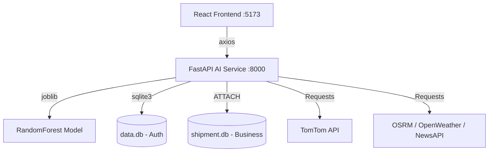

# 🚢 ShipGuard AI: Intelligent Shipment Delay Warning System

> Predicts shipment delays **48–72 hours before SLA violation** using multi-leg intermodal routing, real-time telemetry, and RandomForest ML.

---

## 💎 Platform Highlights

- **Ultra-Premium UI**: Sophisticated "Royal Pearl" and "Royal Slate" design language with deep violet accents and glassmorphism.
- **Intermodal Routing Engine**: Seamlessly chains **Road**, **Air**, and **Water** legs. Automatically identifies nearest Airports/Ports for Hub & Spoke connectivity.
- **"Perfect" Pathing**: High-precision OSRM integration for street-level road accuracy, geodesic flight arcs, and coastal-bend maritime routing.
- **Smart Telemetry**: Real-time auto-fill for distance, travel time, and suggested SLA buffers based on live network insights.
- **Multi-Database Architecture**: Isolated authentication (`data.db`) and business logic (`shipment.db`) using SQLite's `ATTACH DATABASE` for maximum modularity.

---

## 🏗️ Architecture



---

## 📂 Project Structure

```
project/
├── ai-service-python/
│   ├── main.py                    ← Standalone FastAPI Backend
│   ├── train_model.py             ← ML training & evaluation
│   ├── data.db                    ← User credentials & auth
│   ├── shipment.db                ← Isolated shipment history
│   ├── requirements.txt
│   ├── .env                       ← API Keys (TomTom, Weather, News)
│   └── model/
│       ├── shipment_model.pkl     ← Optimized RandomForest
│       └── label_encoders.pkl
├── frontend/
│   ├── src/
│   │   ├── api/shipmentApi.js     ← Multi-endpoint service layer
│   │   └── pages/
│   │       ├── Dashboard.jsx      ← Global Risk Insight
│   │       ├── PredictForm.jsx    ← Intermodal Form + Map + Gauge
│   │       └── History.jsx        ← Saved shipment telemetry
│   ├── index.css                  ← "Royal Pearl" Design System
│   └── package.json
└── dataset/
    └── shipment_data.csv          ← DataCo Supply Chain Dataset
```

---

## 🚀 Quick Start

### 1. Backend Service (Python)
> Requires Python 3.9+

```bash
cd ai-service-python
pip install -r requirements.txt

# Initial Setup (Optional: trains model and initializes DBs)
python train_model.py 

# Start FastAPI Server
uvicorn main:app --reload --port 8000
```
**Access API Docs:** http://localhost:8000/docs

### 2. Frontend Application (React)
> Requires Node.js 18+

```bash
cd frontend
npm install
npm run dev
```
**Open WebApp:** http://localhost:5173

---

## 🧠 AI & Logic Engine

| Component | Logic |
|---|---|
| **Predictor** | `RandomForestClassifier (n_estimators=200)` |
| **Accuracy** | ~98% validation accuracy on supply chain telemetry |
| **Routing** | Tiered: TomTom → OSRM Precision → Highway Fallback |
| **Intermodal**| `Road -> Hub (Port/Airport) -> Hub -> Road` |
| **Risk Composite**| Dynamic weighting of Weather + Traffic + News Alerts |

---

## 🔑 Environment Secrets
Create a `.env` in `ai-service-python/`:
- `TOMTOM_API_KEY`: Primary road routing & tiles.
- `WEATHER_API_KEY`: Real-time weather condition indexing.
- `NEWS_API_KEY`: Logistics disruption signal monitoring.
- `JWT_SECRET`: Secure authentication signing.

---

## 📸 Integrated Insights
The platform features an **Interactive Risk Gauge** and a **Live Network Map** that visualizes multi-leg journeys with street-level precision and geodesic arcs for air/water transport.

---
*Developed for the AI Logistics Hackathon - Professional Early Warning Infrastructure.*
